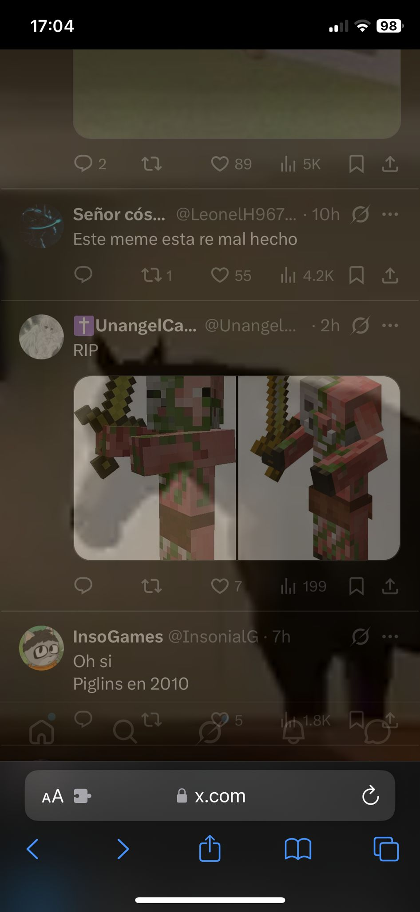
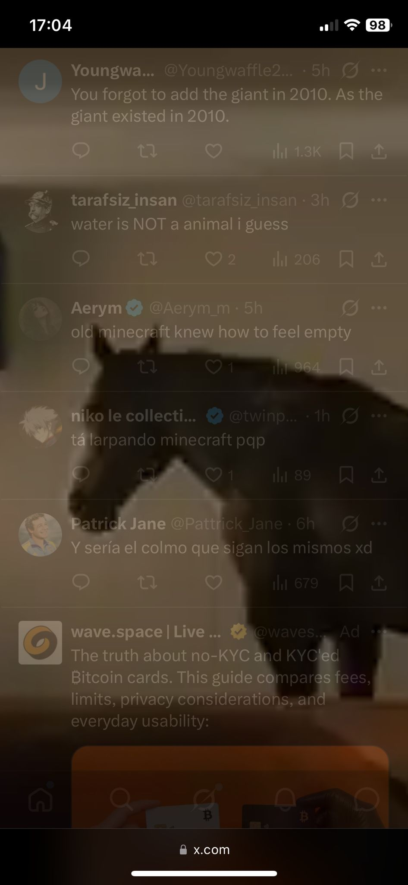
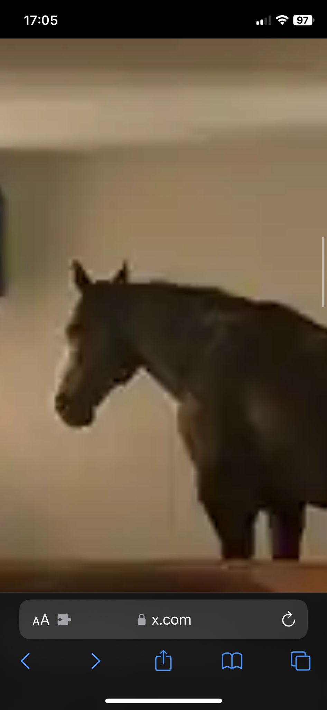

# 🐴 Horse Blocker

Stop doomscrolling, embrace hors.
The horse is inevitable.

A simple userscript that helps reduce doomscrolling on X/Twitter by gradually showing a horse image until it completely blocks the screen.

Available versions:

* **PC** (Tampermonkey)
* **iOS** (Userscripts-compatible browsers/apps)

## How it works

The script follows three phases:

1. **Free browsing**

   * You can use Twitter normally.
   * Duration: **5 minutes**.

2. **Horse fade-in**

   * A horse image progressively appears on top of the page.
   * Interactions with the website become blocked.
   * Duration: **1 minute**.

3. **Full horse**

   * The horse becomes fully visible and completely blocks the website.
   * Duration: **30 minutes**.

After the block period ends, the timer resets automatically.

## Screenshots

<table>
<tr>
<td></td>
<td></td>
</tr>
<tr>
<td></td>
<td></td>
</tr>
</table>

The horse gradually becomes more visible until it completely covers the page.

If you try to refresh the page or close the tabs and enter again, the horse still appears.

## Installation

### PC

1. Install Tampermonkey.
2. Create a new userscript.
3. Paste the contents of `hors_pc.js`.
4. Save and enable the script.

### iOS

1. Use a browser or extension that supports userscripts, e.g. Userscripts on Appstore.
2. Create a new script.
3. Paste the contents of `hors_ios.js`.
4. Save and enable the script.

## Customization

By default, the scripts run on:

* `x.com`
* `twitter.com`

You can easily change the target website by editing the `@match` and `@include` rules.

For example, to use it on Instagram:

```javascript
// @match        *://instagram.com/*
// @match        *://*.instagram.com/*
```

You can also replace the horse image with any other image by changing the embedded Base64 image source.

